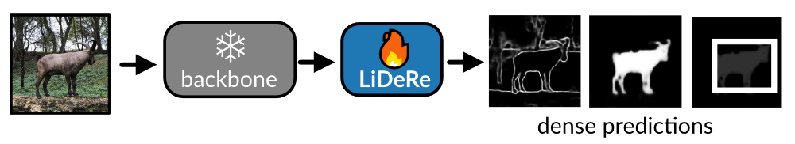
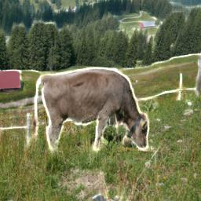

# LiDeRe: A Lightweight Readout for Fast and Data-Efficient Dense Prediction
 
[[`📝 Paper`](https://openaccess.thecvf.com/content/CVPR2026/papers/Luddecke_LiDeRe_A_Lightweight_Readout_for_Fast_and_Data-Efficient_Dense_Prediction_CVPR_2026_paper.pdf)] 
[[`🎬 Video`](https://www.youtube.com/watch?v=qZtYbiRTN5Q)]
[[`🖼️ Poster`](https://owncloud.gwdg.de/index.php/s/PMCH6AnHeqJvKf0)]

A lightweight and parameter-efficient dense readout on top of frozen vision backbones (DINOv3) that matches or outperforms state-of-the-art PEFT methods across semantic segmentation, object detection, pose estimation, and contour prediction — with very few trainable parameters, making it robust to overfitting on small datasets. Can be combined with LoRA for further flexibility.
 
<p align="center">
  
</p>
 
---
 
## ⚙️ Setup
 
LiDeRe requires only a few dependencies:
 
```bash
pip install torch torchvision timm pillow
```
 
Optional (contour prediction, camouflaged training, contour evaluation, quadruped training):
 
```bash
pip install scikit-image scipy torchmetrics opencv-python
```
 
---
 
## 🚀 Inference


First, download and extract the model weights (5MB, MIT license does not apply here):
```bash
wget "https://owncloud.gwdg.de/index.php/s/GahxnxeRKY7ZWWu/download" -O weights.zip && unzip weights.zip -d weights
```

```python
import torch, urllib.request, io
from PIL import Image
from lidere import LiDeRe, TimmBackbone
from torchvision.transforms.functional import to_tensor, to_pil_image

backbone = TimmBackbone(model_name= 'vit_base_patch16_dinov3.lvd1689m', feat_dim=768, feat_stride=16, img_size=512, cls_token='auto', normalize=True, concat_layers=[3,7,10])

# load the model for contour prediction
m = LiDeRe(64, 64, backbone, key_name='sem', n_classes=1).cuda()
weights = m.load_state_dict(torch.load('weights/bsds_vitb.pth', weights_only=True), strict=False)

# load image from url
with urllib.request.urlopen("https://eckerlab.org/img/example/example2.jpg") as r:
    img = to_tensor(Image.open(io.BytesIO(r.read())).resize((512, 512)))

with torch.no_grad():
    out = m(dict(image=img[None,:,None]))

contour = to_pil_image(out['sem'][0,0,0].sigmoid())
```

This will give you this output (here combined with original image):

<p align="center">
  
</p>


## Training on custom data

LiDeRe training is simple: You can provide your data as jpg images and indexed png files and directly start training. Here we train on 4 labeled images
(download with `wget https://eckerlab.org/img/example/{bird.jpg,bird_seg.png,penguins.jpg,penguins_seg.png,sheep.jpg,sheep_seg.png,cow.jpg,cow_seg.png}`)

```python
from lidere.datasets.simple import ImageListDataset, ImageFolderDataset
from lidere import LiDeRe, TimmBackbone, SemanticSegmentationTask, train_simple

pairs = []
for name in ['bird', 'penguins', 'sheep', 'cow']:
    img = Image.open(f"{name}.jpg")
    seg = Image.open(f"{name}_seg.png")
    pairs += [(img, seg)]

d = ImageListDataset(pairs, size=(512, 512))
backbone = TimmBackbone(model_name= 'vit_base_patch16_dinov3.lvd1689m', feat_dim=768, feat_stride=16, img_size=512, cls_token='auto', normalize=True, concat_layers=[3,7,10])
m = LiDeRe(64, 32, backbone, key_name='sem', n_classes=2).cuda()
task = SemanticSegmentationTask(n_classes=2, ignore_index=None)
train_simple(m, d, task, bs=2, n_iter=300)
```

...or if the images are stored in folders `images` (.jpg files) and `labels` (indexed .png files):

```python
d = ImageFolderDataset('images', 'labels/', size=(512, 512))
backbone = TimmBackbone(model_name= 'vit_base_patch16_dinov3.lvd1689m', feat_dim=768, feat_stride=16, img_size=512, cls_token='auto', normalize=True, concat_layers=[3,7,10])
m = LiDeRe(64, 32, backbone, key_name='sem', n_classes=3).cuda()
task = SemanticSegmentationTask(n_classes=3, ignore_index=3)
train_simple(m, d, task, bs=2, n_iter=300)
```


## Training

The required configurations for the training runs are provided in `lidere_all_experiments.json`.
The plantdoc detection training requires the `LiDeReMulti` model.

Make sure `DATA_ROOT` is pointing to the right location, to load datasets.

```python
import json 
from lidere.xdict import xdict
from lidere.trainers.generic import train_simple

# options: ['camo', 'trans10k_easy', 'trans10k_hard', 'leaf', 'pascal', 'irodent', 'horse10', 'plantdoc', 'contour']
experiment_name = 'irodent'
experiment = json.load(open('lidere_all_experiments.json'))[experiment_name]

dataset = xdict(experiment['dataset']).init()
task = xdict(experiment['task']).init()
backbone = TimmBackbone(
  model_name= 'vit_base_patch16_dinov3.lvd1689m', 
  feat_dim=768, 
  feat_stride=16, 
  img_size=512, 
  cls_token='auto', 
  normalize=True, 
  concat_layers=[3,7,10]
)
m = LiDeRe(64, 64, backbone, **experiment['model']).cuda()

dataset_val = experiment['dataset_val']
dataset_val = xdict(dataset_val).init() if dataset_val is not None else None

dataset_test = (xdict(experiment['test_config']) + xdict(experiment['dataset'])).init()

train_simple(m, dataset, task, bs=32)
```


### Dataset downloads:

Make sure `DATA_ROOT` is pointing to the right location.
```bash
mkdir data
export DATA_ROOT=data
```

Run this in project path (where `readme.md` is).

- **LeafSeg:**
```bash
  wget -P $DATA_ROOT https://automl-mm-bench.s3.amazonaws.com/semantic_segmentation/leaf_disease_segmentation.zip
```
- **CamoSemSeg:**
```bash
  wget -P $DATA_ROOT https://automl-mm-bench.s3.amazonaws.com/semantic_segmentation/camo_sem_seg.zip
  wget -O lidere/third_party/conv_lora_metrics.py https://raw.githubusercontent.com/autogluon/autogluon/refs/heads/master/multimodal/src/autogluon/multimodal/optim/metrics/semantic_seg_metrics.py 
```

- **SuperAnimal:**
```bash
  wget -P $DATA_ROOT -O $DATA_ROOT/Quadruped80K_20240925.tar.gz "https://zenodo.org/records/14016777/files/Quadruped80K_20240925.tar.gz?download=1"
```
- **PlantDoc:**
```bash
  git clone https://github.com/pratikkayal/PlantDoc-Object-Detection-Dataset $DATA_ROOT/PlantDoc-Object-Detection-Dataset
```

- **BSR/BSDS500:**
```bash
  wget -P $DATA_ROOT http://www2.eecs.berkeley.edu/Research/Projects/CS/vision/grouping/BSR/BSR_bsds500.tgz
```
For semantic contour evaluation, you need to clone `edge_eval_python` to `third_party`.
```bash
git clone https://github.com/Walstruzz/edge_eval_python.git third_party/edge_eval_python
```

- **Pascal VOC**
```bash
python -c "import torchvision; torchvision.datasets.VOCSegmentation(os.path.join(os.environ['DATA_ROOT']), download=True)"
```

- **Trans10K:** manual download from https://xieenze.github.io/projects/TransLAB/TransLAB.html, then place in `$DATA_ROOT/`. For faster training we resize the images to 800px.


## License

MIT (except weights)
